# maple-m-doljub
`메이플스토리 모바일 정보 서비스` 프로젝트 입니다. <br/><br/>
`2024.04 ~ 2024.06` 동안 `Spring Boot`를 사용해 구현했습니다.<br>
<br>

### ⚙️ 개발 환경

| 사용 기술        |
|--------------|
| Spring Boot 3.2.4 |
| Gradle       |
| Java         |
| Thymeleaf    |
| JPA          |
| Spring Security |


# 📚 목차

- [주요 기능](#주요-기능)
- [ERD (2024.6.16 기준)](#erd-2024616-기준)
- [회원가입 로그인](#회원가입-로그인)
- [캐릭터, 길드 검색](#캐릭터-길드-검색)
- [캐릭터 관리](#캐릭터-관리)
- [캐릭터 정보](#캐릭터-정보)
- [길드 목록](#길드-목록)
- [회원 기능](#회원-기능)
- [프로젝트 구조](#프로젝트-구조)

### 주요 기능

- 로그인 로그아웃
- 캐릭터, 길드 검색
- 캐릭터 관리
- 길드 관리
- 회원 기능
- ~~보스 일정 관리(미구현)~~

### ERD (2024.6.16 기준)
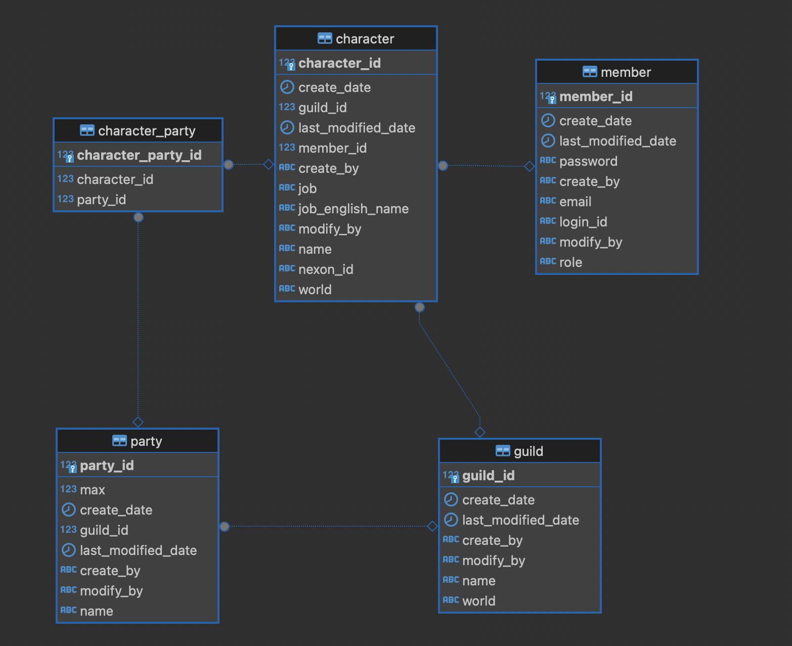

### 회원가입 로그인
- 회원가입
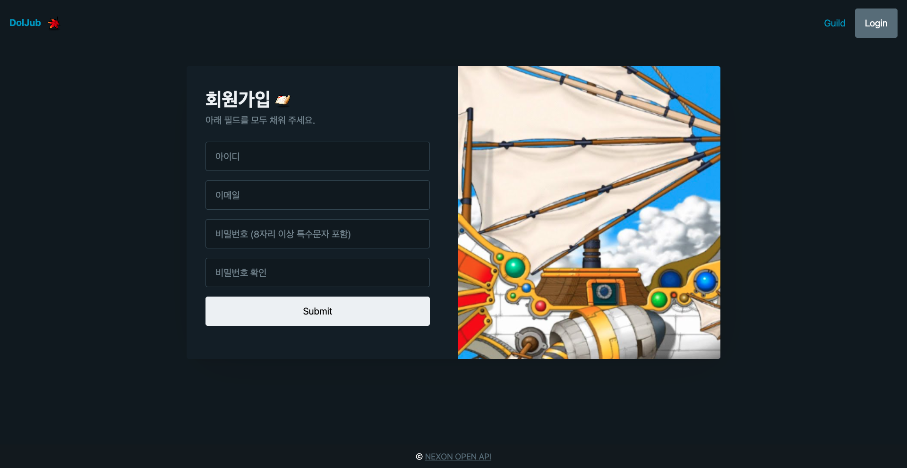
- 로그인
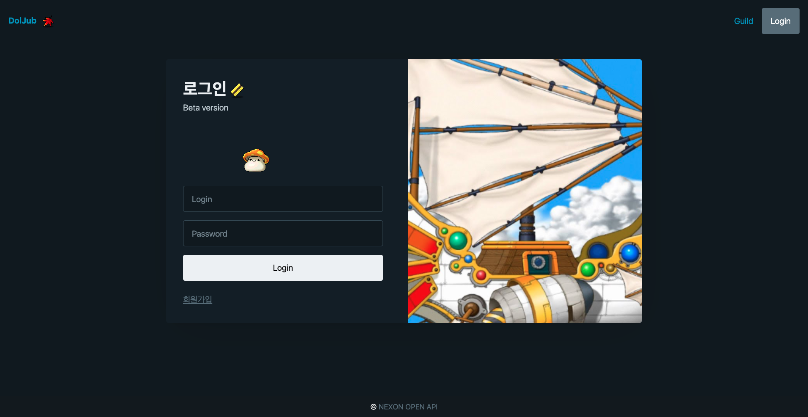

### 캐릭터, 길드 검색
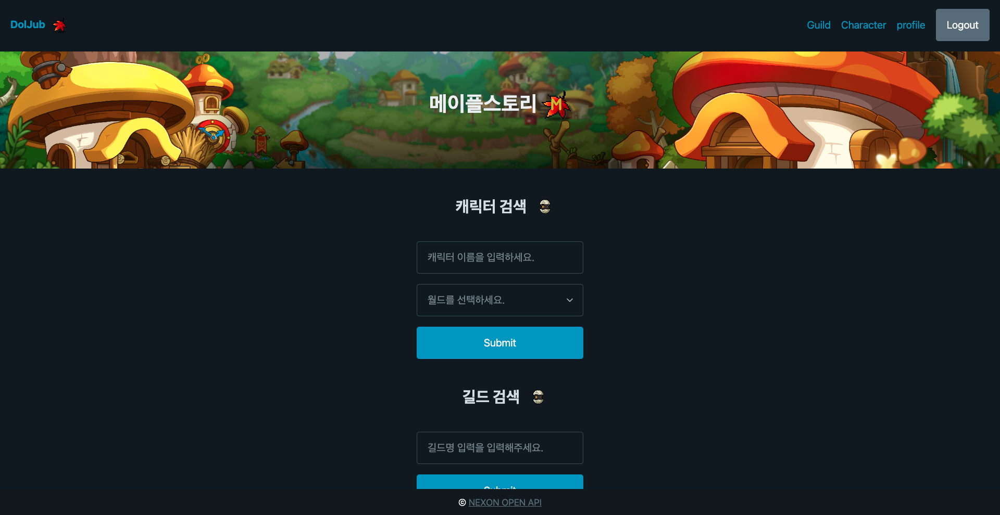

### 캐릭터 관리
- 나의 캐릭터 목록
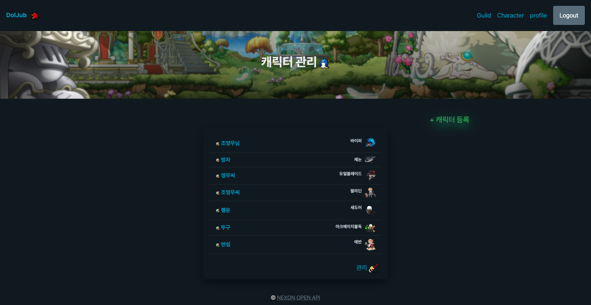
- 새로운 캐릭터 등록
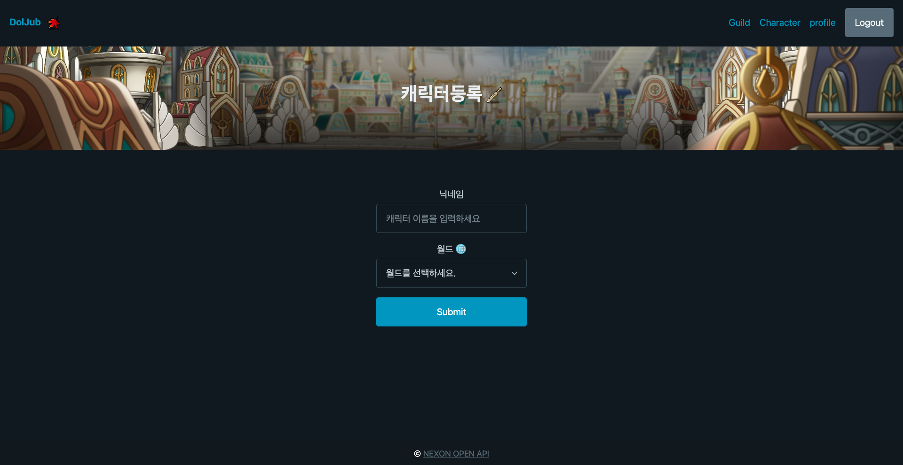
- 나의 캐릭터 삭제


### 캐릭터 정보
- 메이플스토리 모바일 아이템 기준 (일반(X) < 레어(blue) < 에픽(보라) < 유니크(노랑) < 레전드(초록)
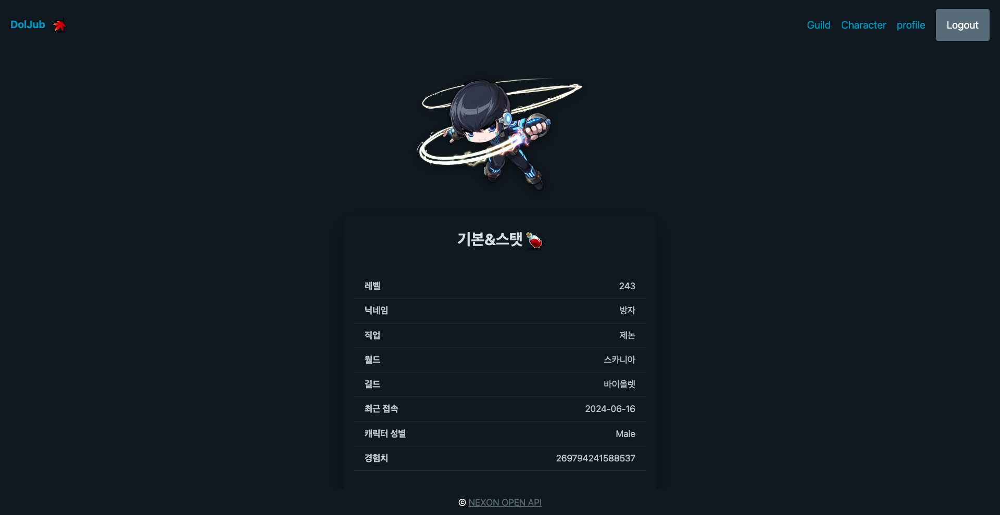
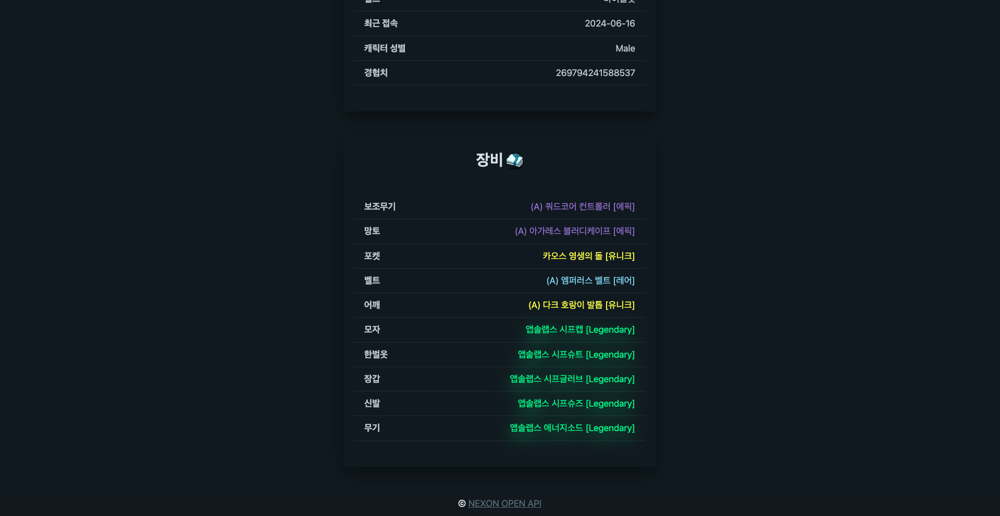

### 길드 목록
- 길드 목록
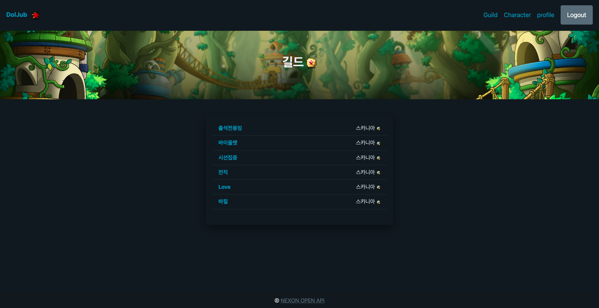
- 길드원 목록
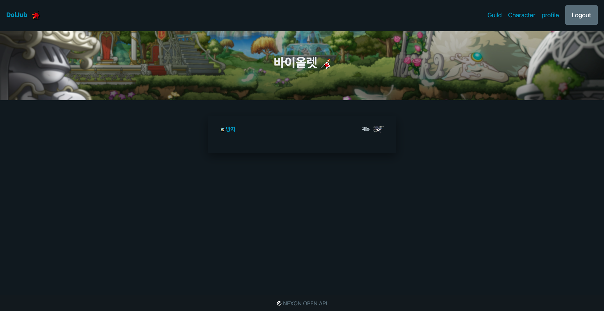

### 회원 기능
- 회원 정보
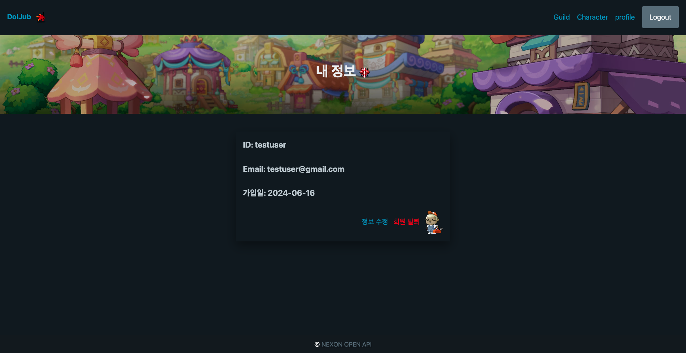
- 회원 수정
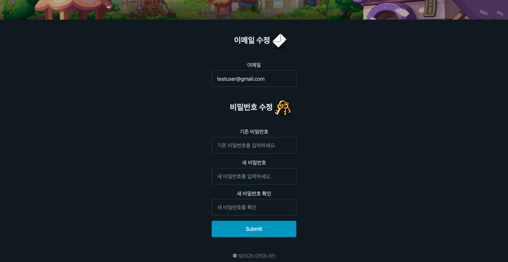
- 회원 탈퇴
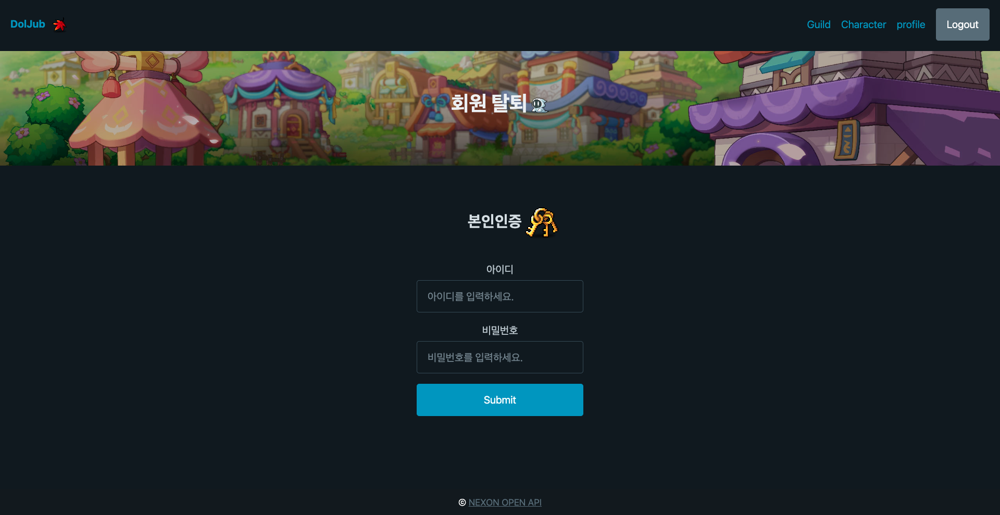

### 프로젝트 구조
```
├── src
│   ├── main
│   │   ├── java
│   │   │   └── maple
│   │   │       └── doljub
│   │   │           ├── DoljubApplication.java
│   │   │           ├── common
│   │   │           │   ├── auditing
│   │   │           │   │   ├── BaseCreateByEntity.java
│   │   │           │   │   ├── BaseTimeEntity.java
│   │   │           │   │   └── MemberAuditorAware.java
│   │   │           │   ├── config
│   │   │           │   │   ├── RestTemplateClient.java
│   │   │           │   │   └── SecurityConfig.java
│   │   │           │   ├── exception
│   │   │           │   │   ├── CustomException.java
│   │   │           │   │   └── ErrorCode.java
│   │   │           │   ├── util
│   │   │           │   │   ├── EquipmentItemFilterUtil.java
│   │   │           │   │   └── JobTranslator.java
│   │   │           │   └── validation
│   │   │           │       ├── ValidationGroups.java
│   │   │           │       └── ValidationSequence.java
│   │   │           ├── controller
│   │   │           │   ├── CharacterController.java
│   │   │           │   ├── GuildController.java
│   │   │           │   ├── MainController.java
│   │   │           │   ├── MemberController.java
│   │   │           │   └── PartyController.java
│   │   │           ├── domain
│   │   │           │   ├── Character.java
│   │   │           │   ├── CharacterParty.java
│   │   │           │   ├── Guild.java
│   │   │           │   ├── Member.java
│   │   │           │   ├── Party.java
│   │   │           │   └── Role.java
│   │   │           ├── dto
│   │   │           │   ├── CharacterDeleteDto.java
│   │   │           │   ├── CharacterInfoResDto.java
│   │   │           │   ├── CharacterRegisterReqDto.java
│   │   │           │   ├── CustomUserDetails.java
│   │   │           │   ├── LoginDto.java
│   │   │           │   ├── MemberDeleteDto.java
│   │   │           │   ├── MemberResDto.java
│   │   │           │   ├── MemberSignUpReqDto.java
│   │   │           │   ├── MemberUpdateReqDto.java
│   │   │           │   └── maple
│   │   │           │       ├── CharacterMapleResDto.java
│   │   │           │       ├── EquipmentItemDto.java
│   │   │           │       ├── GuildMapleResDto.java
│   │   │           │       └── OcidMapleResDto.java
│   │   │           ├── repository
│   │   │           │   ├── CharacterPartyRepository.java
│   │   │           │   ├── CharacterRepository.java
│   │   │           │   ├── GuildRepository.java
│   │   │           │   ├── MemberRepository.java
│   │   │           │   └── PartyRepository.java
│   │   │           └── service
│   │   │               ├── CharacterService.java
│   │   │               ├── CustomUserDetailsService.java
│   │   │               ├── GuildService.java
│   │   │               └── MemberService.java


```